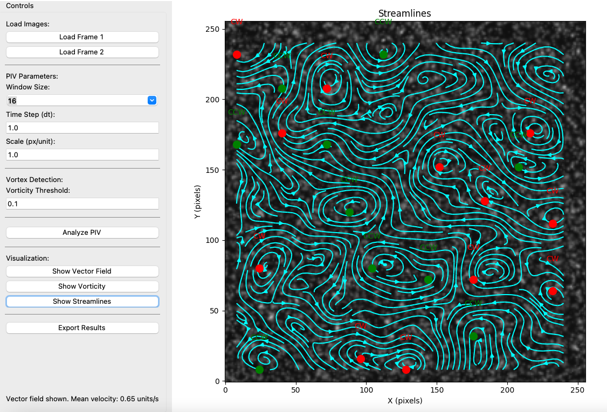

# 🧪 PIV Analyzer

**A high-performance Python GUI tool for Particle Image Velocimetry (PIV) analysis, vortex detection, and vector field visualization.**

---

## 🔬 What is Particle Image Velocimetry (PIV)?

**Particle Image Velocimetry (PIV)** is a non-intrusive optical measurement technique used to analyze fluid flows. It involves:

- Seeding a fluid with tracer particles
- Illuminating the flow using a laser sheet
- Capturing two successive high-speed images
- Analyzing particle displacement using cross-correlation
- Calculating **velocity vector fields**, **vorticity**, and **flow direction**

PIV is widely used in **aerodynamics**, **microfluidics**, **biomedical flows**, and **turbulence research**.

---

## 🚀 Features

🎯 **High-Precision PIV Analysis**  
• FFT-based cross-correlation  
• Gaussian subpixel interpolation  
• Adjustable window size and time step

🌪️ **Vortex Detection**  
• Automatic identification of vortex cores  
• CW/CCW classification  
• Strength-based visualization

📈 **Advanced Visualization**  
• Velocity vector overlay  
• Vorticity contour map  
• Streamline plots

🖼️ **Intuitive GUI**  
• Built with `Tkinter` and `Matplotlib`  
• Frame preview, parameter tuning, and real-time plotting

💾 **Export Options**  
• Save as `.npz`, `.csv`, or high-res `.jpg`  
• Ideal for research documentation

---

## 🧠 Behind the Scenes

| Step | Description |
|------|-------------|
| 1️⃣ | Preprocess frames with grayscale conversion, contrast enhancement (CLAHE), and Gaussian blur |
| 2️⃣ | Divide image into interrogation windows |
| 3️⃣ | Perform FFT-based cross-correlation between frames |
| 4️⃣ | Locate peak displacement and refine using Gaussian subpixel fitting |
| 5️⃣ | Compute local velocities (U, V), vorticity, and SNR |
| 6️⃣ | Detect vortices based on vorticity threshold and region size |

---

## 🎛️ GUI Preview


> Full control panel with frame loading, PIV settings, vortex options, and output export.

---

## 📷 Recommended Camera Settings

| Setting        | Value                            |
|----------------|----------------------------------|
| Mode           | Manual                           |
| ISO            | 100                              |
| Shutter Speed  | 1/500 s *(freeze moderate motion)* |
| Aperture       | f/8 *(good depth of field)*      |
| Focus          | Manual, focused on laser sheet   |
| White Balance  | Daylight                         |
| Image Format   | RAW                              |

🎯 *Ensure bright, crisp particle images without motion blur.*

## Developed by Dhrubo
---

## 📦 Installation

### 🔧 Requirements

```bash
pip install numpy opencv-python matplotlib scipy pillow
